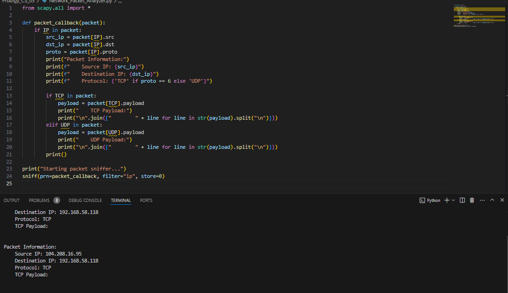

# Network Packet Analyzer

Develop a packet sniffer tool that captures and analyzes network packets. Display relevant information such as source and destination IP addresses, protocols, and payload data.

## Badges

## License

[MIT](https://choosealicense.com/licenses/mit/)

## Screenshots

<h3 align="left">Languages and Tools:</h3>

  

## Authors

- [@md-thalal](https://github.com/md-thalal)

